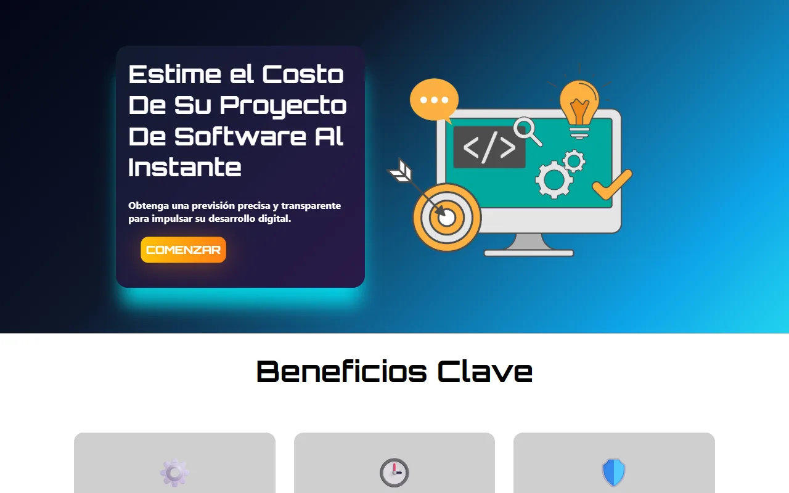
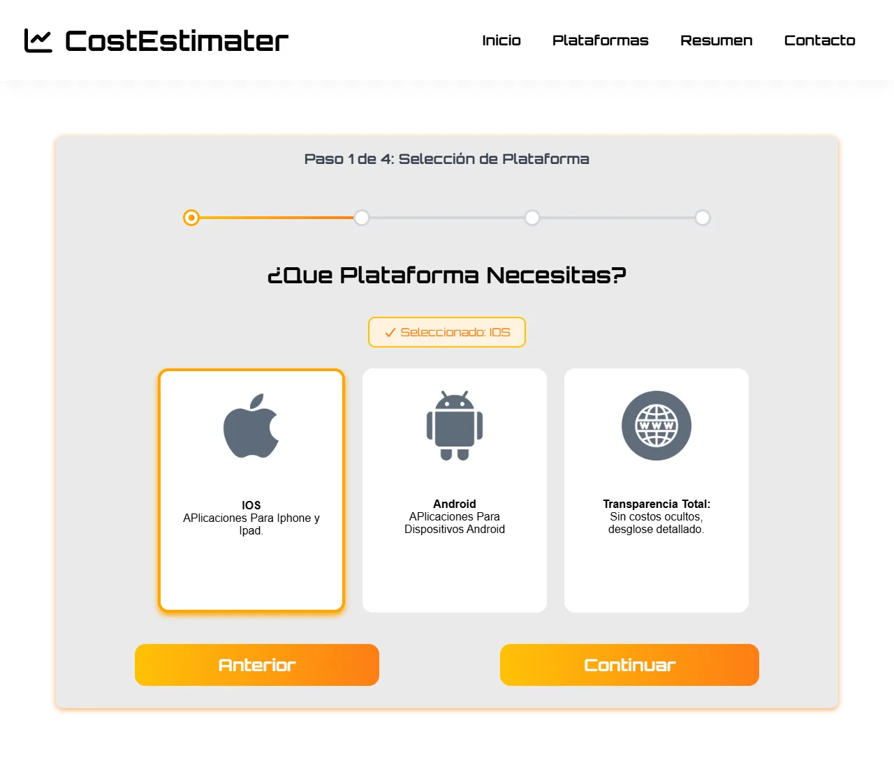
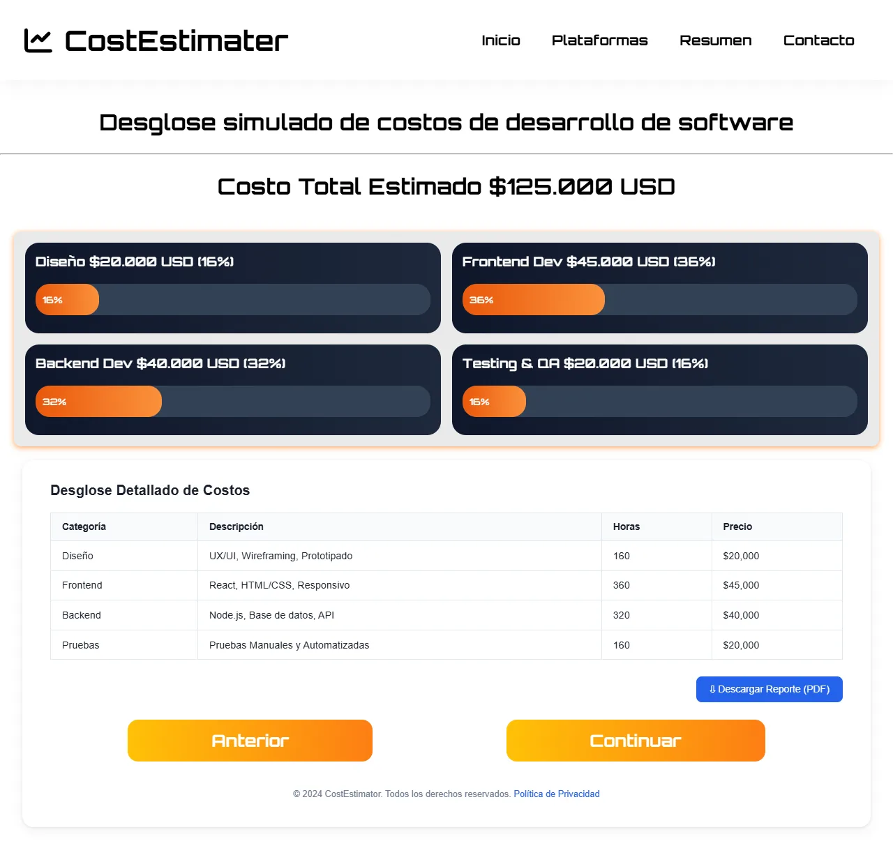
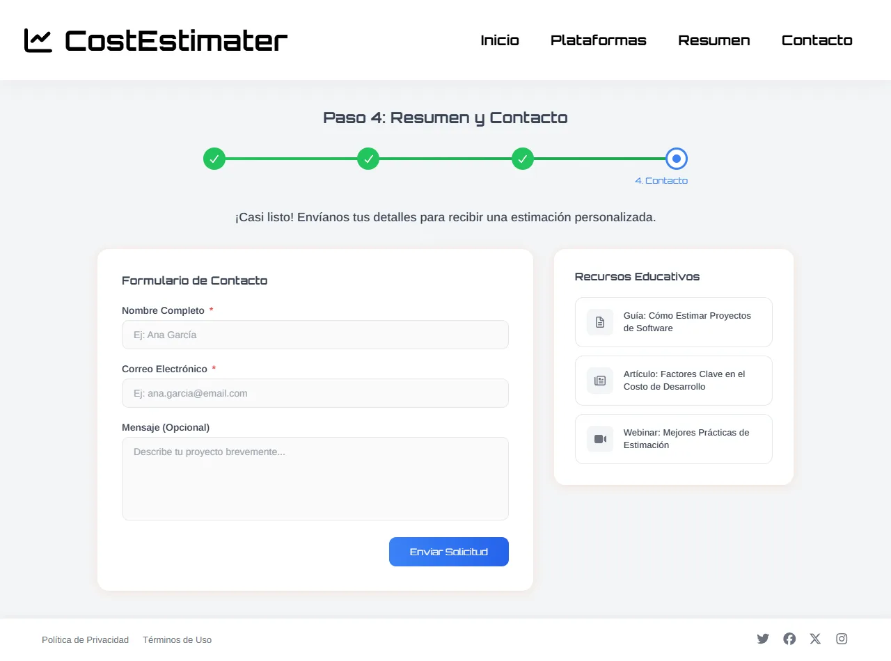
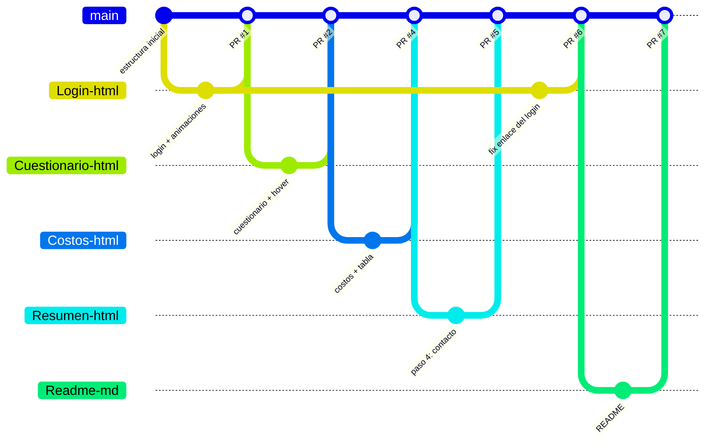

# CostEstimater — estimador de costos de software (HTML y CSS)

Sitio web de 4 pantallas, hecho solo con **HTML5** y **CSS3**, que presenta un estimador de costos para proyectos de software. Recorre la bienvenida, un cuestionario de plataforma, el desglose de costos por fase y un formulario de contacto. Es un ejercicio de maquetación: los costos son de ejemplo y no hay lógica de cálculo.

Este repositorio es la **versión de desarrollo**, construida con una rama y un pull request por pantalla. La variante entregada como examen está en [`Examenhtml`](https://github.com/Eidan210/Examenhtml).




## El problema

Quien quiere encargar un software no sabe cuánto puede costar ni en qué se va el presupuesto. El reto era maquetar, solo con HTML y CSS, un flujo claro que guíe al usuario paso a paso y muestre un presupuesto desglosado y comprensible, adaptado a móvil y a escritorio.

## Tecnologías

| Tecnología | Para qué se usa |
| :--- | :--- |
| **HTML5** | 4 páginas enlazadas con un menú común: bienvenida, cuestionario, costos y contacto. |
| **CSS3** | Variables (`:root`), Flexbox y Grid, `@media` para responsive, `@keyframes` (`fadeUp`), `:hover` y selección de tarjetas con `:checked`. |
| **Font Awesome** | Iconografía del menú y las tarjetas. |
| **Git y GitHub** | Una rama por pantalla y 7 pull requests (6 fusionados), con commits descriptivos. |

## Funciones clave

- **Bienvenida** con propuesta de valor, llamada a la acción y tarjetas de beneficios.
- **Cuestionario de plataforma** (Web, Android, iOS) con tarjetas seleccionables marcadas solo con CSS, sin JavaScript.
- **Desglose de costos:** total estimado, barras de porcentaje por fase (diseño, frontend, backend y pruebas) y tabla de horas y precios.
- **Contacto:** formulario de solicitud, resumen y sección de recursos.
- **Responsive y animado:** se adapta a móvil y escritorio, con animaciones de entrada y efectos *hover*.

## Evidencias

| Cuestionario | Desglose de costos | Contacto |
| :---: | :---: | :---: |
|  |  |  |

### Flujo de trabajo con Git

Cada pantalla se desarrolló en su propia rama y se integró a `main` con un pull request:



## Instalación y uso

Sin dependencias:

```bash
git clone https://github.com/Eidan210/ProyectoHTMLCSS.git
cd ProyectoHTMLCSS
```

Abre `login.html` en el navegador (o con **Live Server**) y avanza con **Comenzar**. Los iconos se cargan desde el kit de Font Awesome, así que necesitan conexión a internet.

```text
ProyectoHTMLCSS/
├── login.html · login.css                 # Bienvenida
├── cuestionario.html · cuestionario.css   # Paso 1: plataforma
├── Costos.html · Costos.css               # Pasos 2-3: desglose de costos
├── Resumen.html · Resumen.css             # Paso 4: contacto y recursos
└── *.png                                  # Ilustraciones e iconos
```

## Aprendizajes

- **Maquetar un flujo de varias páginas** con estructura semántica y una navegación coherente.
- **Resolver interacción solo con CSS:** tarjetas seleccionables con `:checked` y efectos con `:hover`, sin una línea de JavaScript.
- **Diseño responsive** con Flexbox, Grid y `@media`, y animaciones de entrada con `@keyframes`.
- **Trabajar con ramas y pull requests:** una funcionalidad por rama, integraciones revisables y commits que explican el cambio.

---

Desarrollado por **Eidan Alexander Carreño** ([@Eidan210](https://github.com/Eidan210)) · Campuslands.
